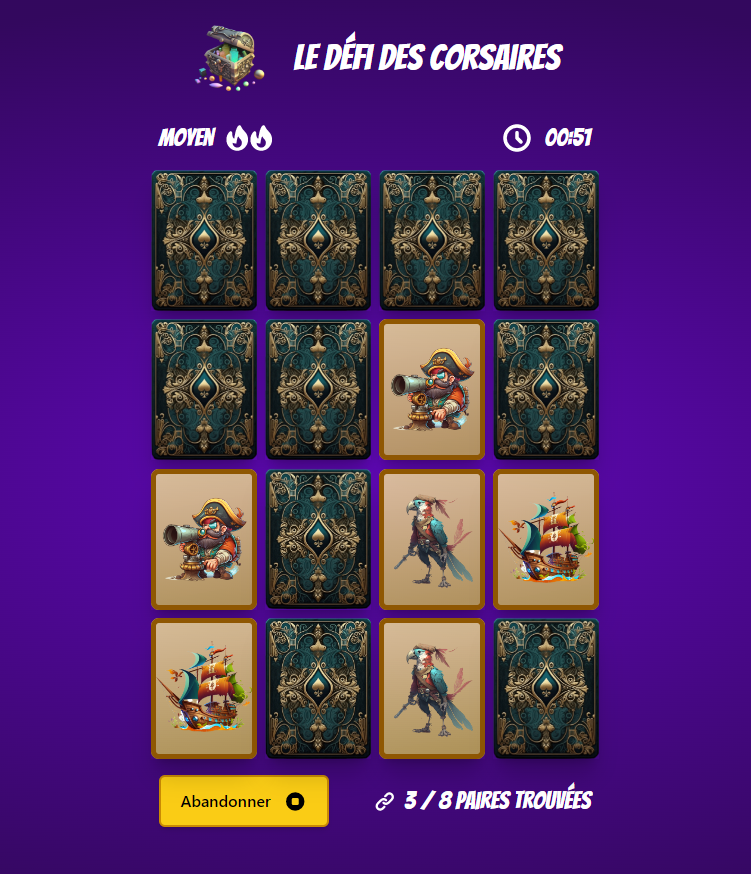

# Le Défi des Corsaires - Workshop module 2



Dans ce workshop, vous allez pouvoir mettre en pratique les connaissances acquises durant le module en développant, étape par étape, un **memory game** sur le thème de la piraterie 🏴‍☠️

Le Memory Game est un jeu de cartes dans lequel le joueur doit trouver des paires de cartes identiques avant la fin du temps imparti. Les cartes sont mélangées et placées face cachée sur une grille. Le joueur doit retourner deux cartes à la fois et essayer de trouver des paires identiques. Si les deux cartes retournées sont identiques, elles restent face visible et le joueur marque un point. Si les deux cartes retournées ne sont pas identiques, elles sont retournées face cachée et le joueur doit essayer à nouveau. Le jeu se termine lorsque toutes les paires ont été trouvées, ou que le temps est écoulé.

## Pré-requis

Avant de commencer, vous devez vous assurer que les outils suivants sont installés sur votre machine :

- **Node.js** (v18.13.0 ou version ultérieure)
- **npm** (v8.19.3 ou version ultérieure)

## Installation

```bash
# Clonez le dépôt GitHub
git clone https://github.com/defi-des-corsaires.git
# Ouvrez le dossier du projet
cd defi-des-corsaires
# Installez les dépendances
npm install
```

## Lancer le jeu

Pour lancer le jeu, exécutez la commande suivante :

```bash
npm start
```

Le jeu devrait être accessible à l'adresse http://localhost:3000/.

## Exercices

Le workshop est découpé en exercices. Pour chaque exercice, une branche git correspondante est disponible sur le dépôt. Avant de commencer un nouvel exercice, vous devez donc checkout la branche correspondante.

Exemple : pour accéder à l'exercice 3, exécutez la commande suivante :

```bash
git checkout exercice-3
```

Si vous souhaitez enregistrer votre code entre chaque exercice, vous pouvez forker le dépôt et pousser votre code sur votre propre fork. Sinon, il suffit de revert les modifications avant de checkout l'exercice suivant.

## Besoin d'aide ?

Si vous rencontrez des difficultés pour réaliser les exercices ou si vous avez des questions, n'hésitez pas à demander de l'aide sur le Discord de Coding Crew. Les membres de la communauté seront ravis de vous aider à progresser dans votre apprentissage !
